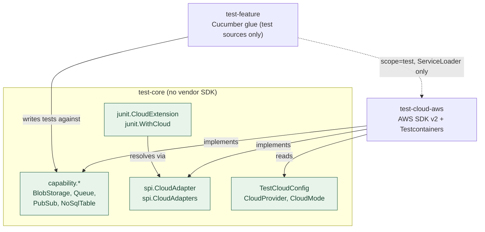
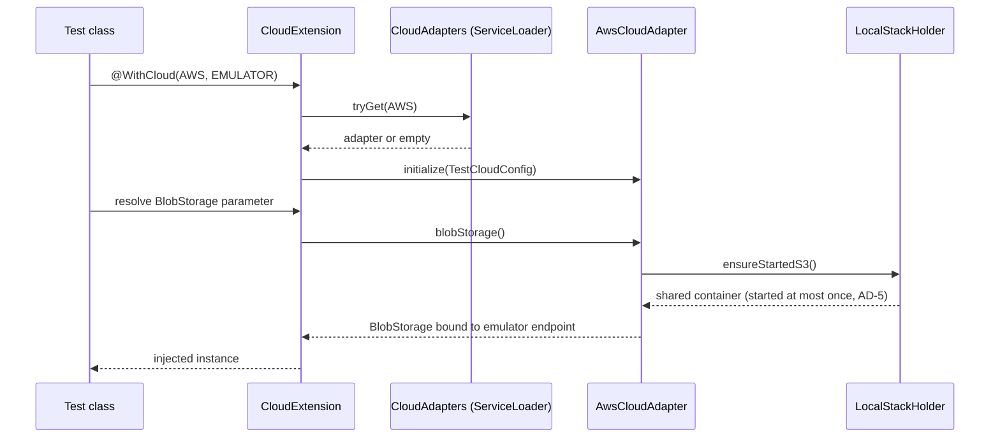

# Architecture Spine — enrich-test-api

## Design Paradigm

Hexagonal, ports and adapters. The ports are the Capability interfaces and the `CloudAdapter` SPI; the adapters are provider modules. The distinguishing property is that the dependency arrow only ever points inward: a provider module depends on the core, never the reverse, and the core has no compile-time knowledge that AWS exists.

| Hexagon role | Maven module | Java package |
| --- | --- | --- |
| Domain and ports | `test-core` | `org.deveasy.test.core.cloud`, `.cloud.capability`, `.cloud.spi` |
| Driving adapter (JUnit) | `test-core` | `org.deveasy.test.core.junit` |
| Driven adapter (AWS) | `test-cloud-aws` | `org.deveasy.test.cloud.aws` |
| Driving adapter (BDD) | `test-feature` | `org.deveasy.test.feature.cloud` (test sources only) |

## Invariants & Rules

### AD-1 — test-core carries no vendor SDK [ADOPTED]

- **Binds:** FR-1, all of `test-core`
- **Prevents:** a capability method growing an AWS type in its signature, which would make every downstream test provider-bound and silently delete the product's reason to exist.
- **Rule:** `test-core`'s resolved compile and provided scopes contain no cloud-vendor artifact. Its only non-test dependency is `junit-jupiter-api` at `provided`. A change that adds a vendor dependency to `test-core` is rejected regardless of convenience.

### AD-2 — Adapters are discovered, never referenced [ADOPTED]

- **Binds:** FR-3, `CloudAdapters`, all provider modules
- **Prevents:** a compile-time `new AwsCloudAdapter()` in core or in a test, which reintroduces the coupling AD-1 removes.
- **Rule:** provider resolution goes through `java.util.ServiceLoader` on `CloudAdapter`, registered under `META-INF/services/org.deveasy.test.core.cloud.spi.CloudAdapter`. The service file is named for the Java package and is unaffected by Maven coordinate changes.

### AD-3 — Capability interfaces stay small and provider-neutral [ADOPTED]

- **Binds:** FR-2, `org.deveasy.test.core.cloud.capability.*`
- **Prevents:** the interfaces drifting toward being a full cloud SDK, which would make a second adapter unimplementable.
- **Rule:** a method may only be added to a Capability if it is implementable on at least two providers using their emulators. Types in signatures come from `java.*` only.

### AD-4 — Provider modules are test-scoped downstream [ADOPTED]

- **Binds:** `test-feature`, any consumer
- **Prevents:** a provider SDK leaking into a consumer's production classpath, and duplicate classes in the reactor.
- **Rule:** `test-feature` depends on `test-cloud-aws` at `scope=test` and excludes the transitive `test-core` so the module is present exactly once.

### AD-5 — One emulator per JVM, lazily started, exactly-once [ADOPTED]

- **Binds:** FR-6, `LocalStackHolder`
- **Prevents:** a container per test class, which multiplies a ~1.3 GB image start across the suite, and a race that leaves two containers running.
- **Rule:** the holder uses an `AtomicReference` with compare-and-set. A thread that loses the race stops its own container and returns the winner. Testcontainers owns shutdown; nothing calls `stop()` on the shared instance.

### AD-6 — The emulator image is pinned and must speak the SDK's protocol

- **Binds:** FR-6, `LocalStackHolder`
- **Prevents:** silent breakage from a floating tag, and the specific failure where the SDK and the emulator disagree on wire protocol.
- **Rule:** the image is pinned to an exact tag. It must serve the AWS JSON protocol for SQS, which AWS SDK v2 uses; `localstack/localstack:2.3` does not and returns HTTP 500 on every SQS call. Minimum known-good is `3.8`. Changing either the SDK major line or the image tag requires running the SQS integration tests before merge.

### AD-7 — Versions are centralised as BOM imports [ADOPTED]

- **Binds:** all four POMs, FR-8
- **Prevents:** modules drifting to different versions of the same library, which surfaces as an Enforcer convergence failure late in a build.
- **Rule:** the parent imports BOMs and declares no module-level versions. A module declares `groupId` and `artifactId` only. Where two ecosystems disagree on a shared transitive, the parent pins it to the highest version already present in the graph and records why in a comment.

### AD-8 — Coverage floors are measured, ratcheted, and never vacuous

- **Binds:** FR-9
- **Prevents:** two failure modes at once: a threshold set aspirationally high that gets skipped in practice, and a rule inherited into a module with no classes, which passes for the wrong reason.
- **Rule:** a JaCoCo `check` is declared only in a module that has main sources, with a floor equal to that module's measured ratio. Floors move up, never down. The root and `test-feature` declare no floor.

### AD-9 — A plain verify needs no network secret

- **Binds:** FR-10
- **Prevents:** the default build depending on an external service and an API key, which makes a clean-machine build fail for reasons unrelated to the code.
- **Rule:** OWASP Dependency-Check lives in the `owasp` profile, never the default lifecycle. Its version is declared once, in the POM. CI invokes the goal without naming a version, so a POM-declared version wins.

### Dependency direction



The dashed edge is the whole design. `test-feature` never references an AWS type; the jar is present only so `ServiceLoader` can find it.

## Consistency Conventions

| Concern | Convention |
| --- | --- |
| Naming — capabilities | Service-shape nouns, not vendor names: `BlobStorage` not `S3`, `NoSqlTable` not `DynamoDB`. |
| Naming — adapters | `Aws<Capability>`, e.g. `AwsBlobStorage`. Provider prefix, capability suffix. |
| Naming — tests | `*Test` for unit tests run by Surefire. `*IT` for emulator-backed tests and `*Suite` for JUnit Platform suites, both run by Failsafe. The distinction is the plugin, and it is load-bearing: a misnamed integration test silently never runs. |
| Data — identifiers | Bucket, queue, topic and table names are caller-supplied `String`. Tests generate unique names per run to avoid cross-test interference. |
| Data — payloads | `byte[]` or `InputStream` for blobs, `String` for messages, `Map<String, Object>` for items. No vendor model types cross a port. |
| Data — absence | An operation that may find nothing returns `Optional`, never null. |
| Errors | Vendor exceptions are caught at the adapter boundary. A missing adapter fails with a message naming the provider; an unsupported capability raises `ParameterResolutionException` naming the type. |
| Config | One immutable `TestCloudConfig` per adapter initialisation, built through its builder. No setters, no statics. |
| Formatting | google-java-format via Spotless, enforced at `verify`. `mvn spotless:apply` before committing. |
| Imports | No star imports in main sources. Checkstyle enforces this; it is the only style rule set that is on. |

## Stack

| Name | Version |
| --- | --- |
| Java | 17 (Temurin) |
| Maven | 3.9 |
| AWS SDK v2 (BOM) | 2.25.64 |
| Testcontainers (BOM) | 1.20.1 |
| JUnit (BOM) | 5.10.2 |
| Cucumber (BOM) | 7.15.0 |
| Jackson (BOM) | 2.17.2 |
| slf4j-api (convergence pin) | 1.7.36 |
| commons-codec (convergence pin) | 1.15 |
| LocalStack image | localstack/localstack:3.8 |
| JaCoCo | 0.8.11 |
| Spotless | 2.43.0 |
| Checkstyle plugin | 3.6.0 |
| Enforcer | 3.4.1 |
| Surefire / Failsafe | 3.2.5 |
| Error Prone | 2.29.2 |
| OWASP Dependency-Check | 13.0.0 |

## Structural Seed

```text
enrich-test-api/
  pom.xml                  # parent: BOM imports, all plugin config, gates
  test-core/               # ports. no vendor SDK. AD-1
    src/main/java/org/deveasy/test/core/
      cloud/               # TestCloudConfig, CloudProvider, CloudMode, Capability
        capability/        # BlobStorage, Queue, PubSub, NoSqlTable
        spi/               # CloudAdapter, CloudAdapters
      junit/               # CloudExtension, WithCloud
  test-cloud-aws/          # driven adapter. AD-2, AD-5
    src/main/java/org/deveasy/test/cloud/aws/
      internal/            # AwsClients, LocalStackHolder
    src/main/resources/META-INF/services/
      org.deveasy.test.core.cloud.spi.CloudAdapter
    src/test/java/...IT.java
  test-feature/            # driving adapter. test sources only, no main
    src/test/java/org/deveasy/test/feature/cloud/
    src/test/resources/features/
  docs/
    adr/                   # 0001-0005
    specs/                 # this spine, PRD, brief, epics
```

### Capability resolution at runtime



## Capability → Architecture Map

| Capability / Area | Lives in | Governed by |
| --- | --- | --- |
| FR-1 vendor-free core | `test-core` | AD-1, paradigm |
| FR-2 four capabilities | `core.cloud.capability`, `cloud.aws` | AD-3 |
| FR-3 adapter discovery | `core.cloud.spi.CloudAdapters` | AD-2 |
| FR-4 immutable config | `core.cloud.TestCloudConfig` | AD-2, config convention |
| FR-5 JUnit injection | `core.junit.CloudExtension` | AD-2, error convention |
| FR-6 emulator lifecycle | `cloud.aws.internal.LocalStackHolder` | AD-5, AD-6 |
| FR-7 BDD glue | `test-feature` test sources | AD-4, naming convention |
| FR-8 gates | parent `pom.xml` | AD-7, AD-9, naming convention |
| FR-9 coverage floors | `test-core`, `test-cloud-aws` POMs | AD-8 |
| FR-10 supply-chain scan | `owasp` profile | AD-9 |

## Deferred

- **A second provider adapter.** The SPI is designed for one but unproven by one. Until an Azure or GCP adapter exists, AD-1 and AD-3 are asserted rather than demonstrated. This is the single largest architectural risk.
- **`CloudMode.LIVE`.** Needs a credential-resolution decision, a cost-control decision, and a story for destructive operations against real accounts. The enum value exists; the path does not.
- **Java package rename to `com.enrichmeai.*`.** The groupId moved; the packages did not. Deferred because it is breaking across every file and touches the `META-INF/services` file name. Wants its own decision.
- **SECRETS and KMS capabilities.** Declared in `CloudServiceType`, no interface behind them.
- **Parallel test execution.** AD-5 gives one shared container; whether capabilities are safe under concurrent tests is untested and unspecified.
- **Maven Central publishing.** The POM still carries OSSRH `distributionManagement` and a nexus-staging plugin, which are inert and unverified.
